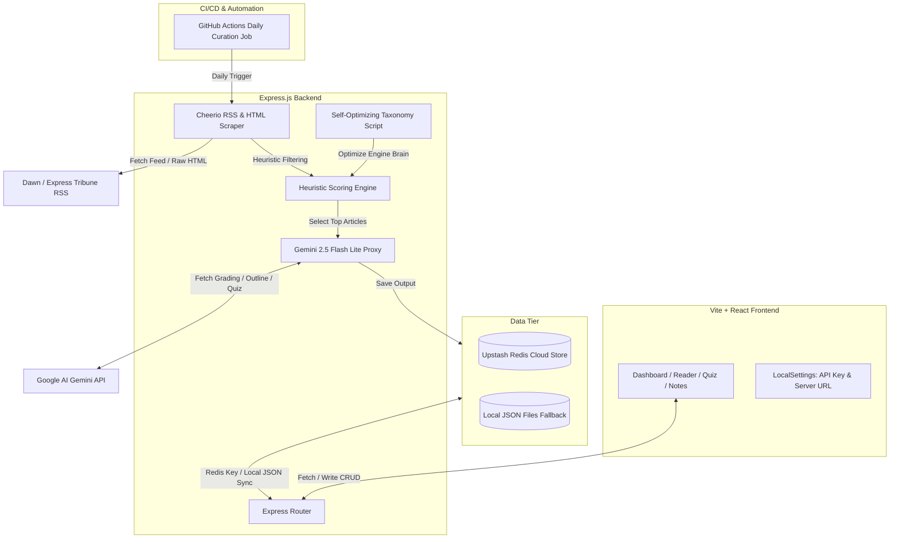

# 🧠 Civil Digest & Policy Companion

A premium, automated web-scraping and AI-curation study companion designed specifically for **Civil Service & Competitive Exams** aspirants. 

This platform aggregates opinion columns and editorials from leading Pakistani newspapers (e.g., *Dawn*, *Express Tribune*, *The News*, *The Friday Times*), screens them through a custom multi-weighted heuristic scoring engine, grades their academic utility using **Google Gemini AI**, maps them to the official syllabus papers (Pakistan Affairs, Current Affairs, English Essay), matches them to past exam questions (2016–2025), and generates detailed notes, quizzes, and standard essay outlines.

---

## 🚀 Key Features

*   **Daily Curation Dashboard:** A curated digest showing only high-value articles with a custom **Policy Score (0–100%)**.
*   **Deep AI Analysis & Evaluation:** For every suitable article, the system generates:
    *   **Why It Matters:** A two-sentence summary of why a civil service candidate must read/quote this article.
    *   **Key Arguments & Facts:** Concise bullet points detailing data-dense points, statistics, dates, and core policy arguments.
    *   **Academic References & Citations:** Suggested books (e.g., Andrew Small's *The China-Pakistan Axis*), treaties, policies (e.g., COP29 Baku Roadmap), or constitutional articles to cite in papers.
    *   **Vocabulary Power-Up:** Definitions and context sentences for advanced words used in the article.
    *   **Daily Quiz:** A 4-question interactive comprehension check to test vocabulary and core argument retention.
    *   **AI Essay Outline:** A complete, structured exam outline (Introduction, Historical Context, Analytical Dimensions, Way Forward, and Conclusion) mapped to the article.
*   **Live News Feeds:** Real-time RSS feeds display candidate columns. Aspirants can manually trigger live Gemini analysis on any active column.
*   **My Notes Bank:** Integrated workspace where students can edit, save, copy, and manage customized study outlines.
*   **Past Papers Match Engine:** Automatically scans and connects articles to subjective exam questions from past civil service exams (2016–2025) using keyword matching.
*   **Relevance Feedback Loop:** Upvote/downvote buttons log user feedback to improve recommendations and automatically fine-tune the filter parameters.
*   **Self-Refinement Taxonomy Brain:** A cron-run script that reads user feedback logs, analyzes mismatches using AI, and automatically adjusts keywords and author lists in the scoring engine.

---

## 🏗️ System Architecture

The application is split into a client-server architecture with a hybrid local-and-cloud data store:



### 📁 Directory Structure
```text
newspaper/
├── .github/
│   └── workflows/
│       └── curate.yml          # Automated daily curation workflow (GitHub Actions)
├── client/                     # Vite + React Frontend application
│   ├── src/
│   │   ├── components/
│   │   │   └── Quiz.jsx        # Interactive quiz UI component
│   │   ├── App.jsx             # Main dashboard UI & API integrations
│   │   ├── App.css             # Main stylesheet components
│   │   └── index.css           # Global typography & design system tokens
│   ├── package.json
│   └── vite.config.js
├── server/                     # Express.js Backend server
│   ├── curatedData.json        # Curated recommendations local database fallback
│   ├── curateCron.js           # Automated daily curation script
│   ├── feedback.json           # Relevance feedback local logs fallback
│   ├── index.js                # Core API endpoints & Express setup
│   ├── notes.json              # Study outlines local database fallback
│   ├── redis.js                # Upstash Redis TCP adapter
│   ├── refineTaxonomy.js       # AI-driven self-optimizing taxonomy job
│   ├── scoringEngine.js        # Hardcoded past exam questions & heuristic filter
│   ├── vercel.json             # Vercel serverless functions deployment configuration
│   └── package.json
├── Past papers/                # Official syllabus PDFs & structured files
├── package.json                # Root orchestration workspace configuration
└── README.md                   # You are here!
```

---

## ⚙️ Under The Hood: The Curation Engines

### 1. Heuristic Scoring Engine (`scoringEngine.js`)
Before sending articles to the Gemini API (to optimize cost and API quota limits), the server passes candidate articles through a multi-weighted formula:
*   **Keyword Score (40%):** Evaluates density of high-yield topics (IMF, fiscal deficit, geoeconomics, regional connectivity, federalism, climate change, asymmetric warfare, etc.).
*   **Author Score (20%):** Matches author names against a curated watchlist of renowned Pakistani policy experts, diplomats, and senior columnists (e.g., Maleeha Lodhi, Munir Akram, Khurram Husain, Sakib Sherani).
*   **Depth Score (20%):** Evaluates academic language density by matching logical transitions (e.g., *structural constraints*, *notwithstanding*, *consequently*, *socio-economic*).
*   **Solution Score (20%):** Searches the final 30% of the column for policy-oriented solutions (e.g., *way forward*, *should implement*, *pragmatic solution*).
*   **Past Paper Match Bonus (+15%):** Grants a bonus if the article matches key concepts in subjective syllabus papers.
$$\text{Relevance Score} = 30 + 0.7 \times (\text{Keyword} \times 0.4 + \text{Author} \times 0.2 + \text{Depth} \times 0.2 + \text{Solution} \times 0.2)$$

### 2. Gemini Curation Engine (`curateCron.js` & `index.js`)
Articles scoring highly in the heuristic filter are sent to **Gemini 2.5 Flash Lite** with a prompt modeling a strict competitive exam examiner. The prompt instructs the model to calculate a precise academic score. Only articles scoring **75% or higher** are marked as suitable. Articles dealing with petty political party debates or personal stories are rejected.

### 3. Self-Optimizing Taxonomy Brain (`refineTaxonomy.js`)
When developers run `npm run optimize-brain`, the server fetches all user-submitted upvote/downvote logs. It prompts Gemini to identify false-positives (irrelevant articles that passed the heuristic filter) and false-negatives, and **writes code directly back** into `scoringEngine.js` to update the keywords, watchlists, and transition cues dynamically.

---

## 🛠️ Getting Started & Installation

### Prerequisites
*   [Node.js](https://nodejs.org/) (v18 or higher recommended)
*   A **Google AI Studio API Key** (to use Gemini functions; get one [here](https://aistudio.google.com/))
*   *(Optional)* An **Upstash Redis** database instance (to use cloud storage sync; create one [here](https://upstash.com/))

### 1. Install Dependencies
Run the install command from the root directory to set up both frontend and backend dependencies:
```bash
npm run install-all
```

### 2. Configuration Setup
Create a `.env` file in your `server/` directory:
```env
PORT=5000
GEMINI_API_KEY=your_google_gemini_api_key
REDIS_URL=your_upstash_redis_connection_url
```

*Note:* If `REDIS_URL` is omitted, the server will read and write to local JSON files (`curatedData.json`, `notes.json`, `feedback.json`).

### 3. Run Locally
To run both the Vite React frontend and Express server concurrently:
```bash
npm run dev
```
*   **Frontend UI:** `http://localhost:5173`
*   **Backend Server:** `http://localhost:5000`

---

## 🕒 Automated Daily Curation Workflow

The daily curation cycle runs automatically on a scheduled **GitHub Actions Cron Job** defined in [curate.yml](file:///.github/workflows/curate.yml):

1.  **Schedule:** Executes every morning at `00:00 UTC` (5:00 AM Pakistan Standard Time).
2.  **Scrape:** Scrapes the morning opinion RSS feeds.
3.  **Evaluate:** Calls Gemini API using `GEMINI_API_KEY` to curate and grade new articles.
4.  **Save:** Pushes new recommendations directly to **Upstash Redis**.
5.  **Commit Backup:** Commits and pushes the fallback `server/curatedData.json` file back to the repository so the production build always displays fresh data.

To trigger the curation job manually:
```bash
cd server
node curateCron.js
```
*(Make sure `GEMINI_API_KEY` is loaded in your terminal profile).*

---

## 🚢 Deployment Guide

### Deploying the Backend (Vercel)
The backend includes a `vercel.json` file configuration. To deploy:
1.  Initialize Vercel CLI or link Vercel to your GitHub repository.
2.  Import the `server` directory as an API service.
3.  Add `GEMINI_API_KEY` and `REDIS_URL` to Vercel Environment Variables.
4.  Deploy! The endpoints will serve serverless routes under `/api/*`.

### Deploying the Frontend (Vite Static Site)
Build the frontend client bundle:
```bash
cd client
npm run build
```
Upload the generated `dist/` directory to Vercel, Netlify, or GitHub Pages.

---

## 🎯 Syllabus Customization
To customize this companion for other exams (e.g., Civil Service / Competitive Exams, UPSC CSE in India, or general International Relations courses):
1.  Open [scoringEngine.js](file:///server/scoringEngine.js).
2.  Modify the `CSS_PAST_QUESTIONS` database array with past exam questions of your target course.
3.  Adjust `CSS_TAXONOMY.keywords` and `CSS_TAXONOMY.authors` with specialized topics and expert watchlists.
4.  Re-run the backend server to see the customized mapping algorithms update immediately.

---

## 📄 License
This repository is configured for educational research purposes. All scraped editorials and columns remain the intellectual property of their original publishers (*Dawn*, *Express Tribune*, etc.).
